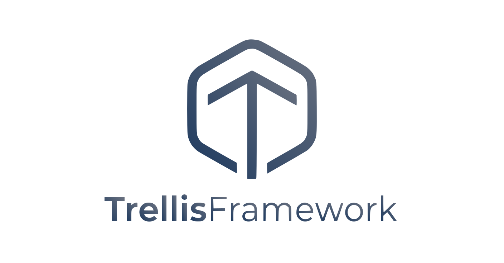

<p align="center">
  
</p>

<p align="center">
  <strong>A comprehensive Java framework for building enterprise microservices with consistent architectural patterns.</strong>
</p>

<p align="center">
  <a href="https://openjdk.org/projects/jdk/21/"></a>
  <a href="https://spring.io/projects/spring-boot"></a>
  <a href="https://spring.io/projects/spring-cloud"></a>
  <a href="https://temporal.io"></a>
  <a href="LICENSE"></a>
</p>

---

## Table of Contents

- [Introduction](#introduction)
- [Getting Started](#getting-started)
  - [Requirements](#requirements)
  - [Installation](#installation)
  - [Project Structure](#project-structure)
  - [Module Structure](#module-structure)
- [Architecture](#architecture)
  - [Layer Overview](#layer-overview)
  - [Standard Architecture (Synchronous)](#standard-architecture-synchronous)
  - [Temporal Architecture (Async)](#temporal-architecture-async)
  - [Callable Rules](#callable-rules)
  - [When to Use Each Pattern](#when-to-use-each-pattern)
- [Core Components](#core-components)
  - [Action](#action)
  - [Task](#task)
  - [RepositoryTask](#repositorytask)
  - [Repository](#repository)
  - [Entity](#entity)
  - [Payload](#payload)
- [Entry Points](#entry-points)
  - [REST Controller](#rest-controller)
  - [gRPC Controller](#grpc-controller)
  - [Event Handler](#event-handler)
  - [Web Controller](#web-controller)
  - [Scheduled Job](#scheduled-job)
- [Temporal Workflows](#temporal-workflows)
  - [WorkflowAction](#workflowaction)
  - [WorkflowTask](#workflowtask)
  - [WorkflowRepositoryTask](#workflowrepositorytask)
  - [Workflow Helper Methods](#workflow-helper-methods)
  - [Parallel Execution](#parallel-execution)
  - [WorkflowOption & ClosePolicy](#workflowoption--closepolicy)
- [Validation](#validation)
  - [Annotation-Based Validation](#annotation-based-validation)
  - [FluentValidator](#fluentvalidator)
  - [Available Validation Annotations](#available-validation-annotations)
- [Data Access](#data-access)
  - [JPA / SQL (data-sql)](#jpa--sql-data-sql)
  - [MongoDB (data-mongo)](#mongodb-data-mongo)
  - [Elasticsearch (data-elastic)](#elasticsearch-data-elastic)
  - [Enum Converters](#enum-converters)
  - [State Machine](#state-machine)
  - [Pessimistic Locking](#pessimistic-locking)
- [Caching](#caching)
  - [Redis Cache (cache-redis)](#redis-cache-cache-redis)
  - [Caffeine Cache (cache-caffeine)](#caffeine-cache-cache-caffeine)
  - [Cache Configuration](#cache-configuration)
- [Distributed Locking](#distributed-locking)
- [Rate Limiting](#rate-limiting)
- [Messaging & Streaming](#messaging--streaming)
  - [Kafka (stream-kafka)](#kafka-stream-kafka)
  - [RabbitMQ (stream-rabbit)](#rabbitmq-stream-rabbit)
- [Security & OAuth](#security--oauth)
  - [Keycloak Integration](#keycloak-integration)
  - [Role-Based Access Control](#role-based-access-control)
  - [Multi-Tenancy](#multi-tenancy)
- [HTTP Client](#http-client)
- [Email & Messaging](#email--messaging)
- [WebSocket](#websocket)
- [Utilities](#utilities)
  - [AWS S3 Client](#aws-s3-client)
  - [Cryptography](#cryptography)
  - [JWT Tokens](#jwt-tokens)
  - [Export (Excel / CSV)](#export-excel--csv)
  - [Load Balancing](#load-balancing)
  - [Other Utilities](#other-utilities)
- [Configuration](#configuration)
- [Error Handling](#error-handling)
- [Logging](#logging)
- [Concurrency](#concurrency)
- [Code Style](#code-style)
- [Deployment](#deployment)
- [Module Reference](#module-reference)
- [Technology Stack](#technology-stack)

---

## Introduction

Trellis Framework is an opinionated, full-featured Java framework built on top of Spring Boot 4.0 and Spring Cloud 2025. It provides a standardized architecture for building enterprise-grade microservices with consistent patterns across all layers of your application.

**Key Features:**

- **Action/Task Pattern** — Clean separation between use cases (Actions) and atomic operations (Tasks), enforcing stateless, thread-safe components
- **Multi-Database Support** — Unified repository abstraction for JPA/PostgreSQL, MongoDB, and Elasticsearch with QueryDSL integration
- **Temporal Workflows** — First-class integration with Temporal.io for durable, long-running business processes with retry and compensation
- **Built-in Validation** — Dual validation with Jakarta annotations for static rules and FluentValidator for dynamic business rules
- **Distributed Infrastructure** — Redis caching with TTL, distributed locking with Redisson, and advanced rate limiting out of the box
- **Message Streaming** — Kafka and RabbitMQ support through Spring Cloud Stream abstraction
- **Security** — OAuth2 resource server with Keycloak, multi-tenancy, and role-based access control
- **Developer Utilities** — AWS S3, cryptography, JWT, Excel/CSV export, load balancers, email services, and WebSocket support

---

## Getting Started

### Requirements

| Requirement | Version |
|-------------|---------|
| Java | 21+ |
| Maven | 3.9+ |
| Spring Boot | 4.0.1 |
| Spring Cloud | 2025.1.0 |

### Installation

Add Trellis as the parent POM and include the modules you need:

```xml
<parent>
    <groupId>net.trellisframework</groupId>
    <artifactId>boot</artifactId>
    <version>LATEST</version>
</parent>

<dependencies>
    <!-- Core framework (required) -->
    <dependency>
        <groupId>net.trellisframework</groupId>
        <artifactId>context</artifactId>
    </dependency>

    <!-- Database access -->
    <dependency>
        <groupId>net.trellisframework</groupId>
        <artifactId>data-sql</artifactId>
    </dependency>

    <!-- HTTP client & exceptions -->
    <dependency>
        <groupId>net.trellisframework</groupId>
        <artifactId>http</artifactId>
    </dependency>

    <!-- Validation annotations -->
    <dependency>
        <groupId>net.trellisframework</groupId>
        <artifactId>validator</artifactId>
    </dependency>

    <!-- Add more modules as needed -->
</dependencies>
```

**Minimal setup** requires only `context`. Add other modules based on your needs:

| Need | Module |
|------|--------|
| SQL database (PostgreSQL, Oracle) | `data-sql` |
| MongoDB | `data-mongo` |
| Elasticsearch | `data-elastic` |
| Redis caching & distributed locks | `cache-redis` |
| In-memory caching | `cache-caffeine` |
| Kafka messaging | `stream-kafka` |
| RabbitMQ messaging | `stream-rabbit` |
| OAuth2 / Keycloak | `oauth-resource-keycloak` |
| Temporal workflows | `workflow-temporal` |
| HTTP client (Retrofit) | `http` |
| Custom validators | `validator` |
| Email services | `message` |
| WebSocket | `socket-websocket` |
| Utilities (AWS, Crypto, JWT, Export) | `util` |

### Project Structure

A typical Trellis microservice project follows this layout:

```
project-root/
├── pom.xml                              # Parent POM inheriting from Trellis
│
├── libs/                                # Shared Libraries
│   ├── lib-general/                     # Configuration & shared utilities
│   │   └── com.example.lib.general
│   │       ├── config/                  # IConfig implementations
│   │       ├── constant/                # Shared constants
│   │       └── util/                    # Utility classes
│   │
│   ├── lib-sql/                         # Database abstraction layer
│   │   └── com.example.lib.sql
│   │       ├── model/                   # BaseEntity, embeddables
│   │       └── transform/              # Enum converters
│   │
│   └── lib-{domain}/                    # Domain-specific shared library
│       └── com.example.lib.{domain}
│           ├── common/                  # Shared enums, models
│           ├── domain/                  # Domain models
│           └── util/                    # Domain utilities
│
└── apps/
    └── {service-name}/                  # Microservice Application
        └── com.example.{service}
            ├── user/                    # Feature module
            ├── order/                   # Feature module
            └── common/                  # Shared service utilities
```

### Module Structure

Each feature module follows a consistent, predictable structure:

```
user/
├── action/                              # Use case handlers (orchestrators)
│   ├── AddUserAction.java
│   ├── ReadUserAction.java
│   ├── UpdateUserAction.java
│   ├── DeleteUserAction.java
│   ├── BrowseUserAction.java
│   └── ProcessUserAction.java
│
├── task/                                # Atomic operations
│   ├── SaveUserTask.java
│   ├── FindUserByIdTask.java
│   ├── FindUserByEmailTask.java
│   ├── ExistsUserByEmailTask.java
│   └── SendWelcomeEmailTask.java
│
├── repository/                          # Data access interfaces
│   └── UserRepository.java
│
├── model/                               # JPA entities & embeddables
│   └── UserEntity.java
│
├── payload/                             # Request/Response DTOs
│   ├── AddUserRequest.java
│   ├── ReadUserRequest.java
│   ├── BrowseUserRequest.java
│   ├── UpdateUserRequest.java
│   └── User.java                        # Response DTO
│
├── constant/                            # Module-level constants
│   ├── Config.java                      # Configuration keys
│   ├── Constant.java                    # Static constants
│   └── Messages.java                    # Error/info message keys
│
├── transformer/                         # Enum & type converters
│   └── Transformers.java
│
├── job/                                 # Scheduled background jobs
│   ├── ProcessUserJob.java
│   └── StuckUserJob.java
│
└── api/                                 # Entry points
    ├── rest/                            # REST controllers
    │   ├── UserUMController.java        # User Management
    │   └── UserSMController.java        # System Management
    ├── grpc/                            # gRPC controllers
    │   └── UserGMController.java
    ├── event/                           # Cloud event handlers
    │   └── UserEventHandler.java
    └── web/                             # Web (SSR) controllers
        └── UserWebController.java
```

---

## Architecture

### Layer Overview

Trellis enforces a strict layered architecture with clear boundaries between components:

```
┌─────────────────────────────────────────────────────────────────────┐
│                          ENTRY POINTS                                │
│   REST  │  gRPC  │  Event Handler  │  Web Controller  │  Job        │
└────────────────────────────┬────────────────────────────────────────┘
                             │
┌────────────────────────────▼────────────────────────────────────────┐
│                      ORCHESTRATOR LAYER                              │
│  ┌──────────────────────┐       ┌────────────────────────────────┐  │
│  │       Action         │       │        WorkflowAction          │  │
│  │  - @Service          │       │  - @Workflow                   │  │
│  │  - Synchronous       │       │  - Temporal (durable/async)    │  │
│  └──────────┬───────────┘       └──────────────┬─────────────────┘  │
│             │                                  │                    │
└─────────────┼──────────────────────────────────┼────────────────────┘
              │                                  │
┌─────────────▼──────────────────────────────────▼────────────────────┐
│                         TASK LAYER                                    │
│  ┌──────────────┐  ┌──────────────────┐  ┌────────────────────────┐ │
│  │    Task      │  │  RepositoryTask  │  │  WorkflowTask /        │ │
│  │  - @Service  │  │  - @Service      │  │  WorkflowRepositoryTask│ │
│  │  - Atomic    │  │  - DB operations │  │  - @Activity           │ │
│  └──────────────┘  └────────┬─────────┘  └───────────┬────────────┘ │
│                              │                        │              │
└──────────────────────────────┼────────────────────────┼──────────────┘
                               │                        │
┌──────────────────────────────▼────────────────────────▼──────────────┐
│                       DATA ACCESS LAYER                               │
│  GenericJpaRepository  │  GenericMongoRepository  │  GenericElastic.. │
└─────────────────────────────────────────────────────────────────────┘
```

### Standard Architecture (Synchronous)

For typical CRUD and synchronous operations:

```
┌──────────────────────────────────────────────────────────────────┐
│                         Entry Points                              │
│  REST  │  gRPC  │  Event  │  Web  │  Job                         │
└───────────────────────┬──────────────────────────────────────────┘
                        │
                        ▼
┌───────────────────────────────────────────────────────────────────┐
│                      Action Layer                                  │
│  - Use case handlers (orchestrators)                               │
│  - Can call: other Actions, Tasks, RepositoryTasks                 │
│  - CANNOT call: WorkflowTasks, WorkflowRepositoryTasks             │
└───────────────────────┬──────────────────────────────────────────┘
                        │
                        ▼
┌───────────────────────────────────────────────────────────────────┐
│                  Task / RepositoryTask Layer                       │
│  - Task: Atomic operations (one operation per task)                │
│  - RepositoryTask: Database operations via getRepository()         │
│  - Can call: NOTHING (isolated and atomic)                         │
└───────────────────────┬──────────────────────────────────────────┘
                        │
                        ▼
┌───────────────────────────────────────────────────────────────────┐
│                     Repository Layer                               │
│  - GenericJpaRepository with QueryDSL                              │
│  - GenericMongoRepository                                          │
│  - GenericElasticRepository                                        │
└───────────────────────────────────────────────────────────────────┘
        │                       │                       │
        ▼                       ▼                       ▼
   PostgreSQL              MongoDB              Elasticsearch
```

### Temporal Architecture (Async)

For long-running, durable business processes:

```
┌──────────────────────────────────────────────────────────────────┐
│                         Entry Points                              │
│  REST Controller  │  gRPC Controller  │  Event Handler            │
└───────────────────────┬──────────────────────────────────────────┘
                        │
                        ▼
┌───────────────────────────────────────────────────────────────────┐
│                   WorkflowAction Layer                             │
│  - Temporal Workflow (durable, survives restarts)                  │
│  - Can call: ALL Task types + child WorkflowActions                │
│  - Annotations: @Workflow, @Async                                  │
└───────────────────────┬──────────────────────────────────────────┘
                        │
          ┌─────────────┼─────────────┐
          ▼                           ▼
┌─────────────────────┐  ┌───────────────────────────────────────┐
│  Shared Tasks       │  │  Temporal-Only Tasks                   │
│  Task               │  │  WorkflowTask (@Activity)              │
│  RepositoryTask     │  │  WorkflowRepositoryTask (@Activity)    │
│  (@Service)         │  │  - Supports @Retry, @Backoff           │
└─────────────────────┘  └───────────────────────────────────────┘
                        │
                        ▼
                 Temporal Server
              (Workflow State Store)
```

### Callable Rules

| Component | Can Call | Cannot Call |
|-----------|----------|-------------|
| **Action** | Actions, Tasks, RepositoryTasks | WorkflowTasks, WorkflowActions |
| **WorkflowAction** | WorkflowTasks, WorkflowRepositoryTasks, Tasks, RepositoryTasks, child WorkflowActions | Actions |
| **Task** | **Nothing** (atomic) | Everything |
| **RepositoryTask** | Repository methods only (via `getRepository()`) | Actions, Tasks |
| **WorkflowTask** | **Nothing** (atomic) | Everything |
| **WorkflowRepositoryTask** | Repository methods only (via `getRepository()`) | Actions, Tasks |
| **FluentValidator** | Actions, Tasks, RepositoryTasks | WorkflowTasks, WorkflowActions |
| **Controller / Job** | Actions, Tasks, RepositoryTasks, WorkflowActions | WorkflowTasks |

### When to Use Each Pattern

| Pattern | Use Case | Example |
|---------|----------|---------|
| **Action** | Simple CRUD, synchronous operations, fast response | Adding a user, reading an order |
| **WorkflowAction** | Long-running processes, retries, async pipelines | Payment processing, email verification |
| **Job** | Periodic maintenance, batch cleanup, scheduled tasks | Stuck record recovery, data sync |

---

## Core Components

### Critical Rules

All Action, Task, RepositoryTask, WorkflowAction, WorkflowTask, and WorkflowRepositoryTask classes **must** follow these rules:

1. **NO instance variables (fields)** — Must be completely stateless
2. **NO additional methods** — Only the `execute()` method is allowed
3. **NO `@Autowired` fields** — Use `call()` method for dependencies
4. **NO helper/utility methods** — Extract to separate utility classes

**Why?** Trellis manages these classes as stateless singletons. Adding state causes thread-safety issues in concurrent processing.

```java
// WRONG - Violates all rules
@Service
public class ProcessUserAction implements Action1<User, ProcessUserRequest> {
    private String tempValue;           // FORBIDDEN - instance variable

    @Autowired
    private SomeService service;        // FORBIDDEN - autowired field

    private String helper() { ... }     // FORBIDDEN - additional method
}

// CORRECT - Stateless, single execute() method
@Service
public class ProcessUserAction implements Action1<User, ProcessUserRequest> {
    @Override
    public User execute(ProcessUserRequest request) {
        String value = call(CalculateValueTask.class, request);
        return call(CreateUserTask.class, value);
    }
}
```

---

### Action

Actions represent **Use Cases** — each Action handles one complete business operation by orchestrating Tasks.

**Interfaces:** `Action` (no args), `Action1<R, P>`, `Action2<R, P1, P2>` ... up to `Action5<R, P1, P2, P3, P4, P5>`

**Annotation:** `@Service`

**Naming Convention:**

| Prefix | Operation |
|--------|-----------|
| `Add{Entity}Action` | Create |
| `Read{Entity}Action` | Single read |
| `Browse{Entity}Action` | List / paginated |
| `Find{Entity}By{Criteria}Action` | Search by criteria |
| `Update{Entity}Action` | Update |
| `Delete{Entity}Action` | Delete |
| `Process{Entity}Action` | Complex processing |

**Example:**

```java
@Service
public class AddUserAction implements Action1<User, AddUserRequest> {

    @Override
    public User execute(AddUserRequest request) {
        UserEntity entity = UserEntity.of(request);
        entity = call(SaveUserTask.class, entity);
        call(SendWelcomeEmailTask.class, entity);
        return plainToClass(entity, User.class);
    }
}
```

**Composition — calling other Actions and Tasks:**

```java
@Override
public User execute(AddUserRequest request) {
    // Call another action
    UserProfile profile = call(GetDefaultProfileAction.class);

    // Call a repository task
    UserEntity entity = call(SaveUserTask.class, UserEntity.of(request, profile));

    // Async fire-and-forget
    CompletableFuture.runAsync(() -> call(SendNotificationAction.class, entity));

    return plainToClass(entity, User.class);
}
```

---

### Task

Tasks are **single-purpose atomic operations** — each Task does exactly ONE thing. Tasks cannot call anything else.

**Interfaces:** `Task` (no args), `Task1<R, P>`, `Task2<R, P1, P2>` ... up to `Task5`

**Annotation:** `@Service`

**Naming Convention:**

| Prefix | Operation |
|--------|-----------|
| `Notify{Event}Task` | Send notifications |
| `Calculate{Value}Task` | Compute values |
| `Transform{Data}Task` | Data transformation |
| `Validate{Entity}Task` | Business validation |
| `Send{Message}Task` | External communication |
| `Call{Service}Task` | External API calls |

**Example:**

```java
@Service
public class SendWelcomeEmailTask implements Task1<Void, UserEntity> {

    @Override
    public Void execute(UserEntity user) {
        emailClient.send(user.getEmail(), "Welcome!", "Hello " + user.getName());
        return null;
    }
}
```

---

### RepositoryTask

RepositoryTasks are **single database operations** with access to exactly ONE repository.

**Interface:** `RepositoryTask1<Repository, ReturnType, InputType>` (up to `RepositoryTask5`)

**Annotation:** `@Service`

**Default Transaction:** `@Transactional(propagation = REQUIRES_NEW, rollbackFor = Exception.class)`

**Naming Convention:**

| Prefix | Operation |
|--------|-----------|
| `Save{Entity}Task` | Save single entity |
| `SaveAll{Entity}Task` | Save collection |
| `Find{Entity}By{Criteria}Task` | Find operations |
| `Update{Entity}By{Criteria}Task` | Updates |
| `Delete{Entity}Task` | Delete |
| `Count{Entity}By{Criteria}Task` | Count |
| `Exists{Entity}By{Criteria}Task` | Existence check |

**Examples:**

```java
@Service
public class SaveUserTask implements RepositoryTask1<UserRepository, UserEntity, UserEntity> {

    @Override
    public UserEntity execute(UserEntity entity) {
        return getRepository().save(entity);
    }
}

@Service
public class FindUserByIdTask implements RepositoryTask1<UserRepository, Optional<UserEntity>, String> {

    @Override
    public Optional<UserEntity> execute(String id) {
        return getRepository().findById(id);
    }
}

@Service
public class ExistsUserByEmailTask implements RepositoryTask1<UserRepository, Boolean, String> {

    @Override
    public Boolean execute(String email) {
        return getRepository().findByEmail(email).isPresent();
    }
}
```

---

### Repository

Repositories extend `GenericJpaRepository` with built-in QueryDSL support.

**Annotation:** `@Repository`

**Base Interface:** `GenericJpaRepository<TEntity, ID>` — extends `JpaRepository`, `QuerydslPredicateExecutor`

**Built-in Methods from `GenericJpaRepository`:**

| Method | Description |
|--------|-------------|
| `getFactory()` | Get `JPAQueryFactory` for QueryDSL queries |
| `getEntityManager()` | Get JPA `EntityManager` |
| `select(expressions)` | Start a select query |
| `selectFrom(entity)` | Select from entity |
| `selectDistinct(expressions)` | Distinct select |
| `update(entity)` | Update query |
| `delete(entity)` | Delete query |
| `insert(entity)` | Insert query |
| `upsert(entity, columns)` | Insert or update operations |
| `findAll(predicate, pageable)` | Paginated find with predicate |

**Example:**

```java
@Repository
public interface UserRepository extends GenericJpaRepository<UserEntity, String> {

    Optional<UserEntity> findByEmail(String email);

    default List<UserEntity> findPendingUsers(int limit) {
        QUserEntity entity = QUserEntity.userEntity;
        return getFactory().selectFrom(entity)
            .where(entity.state.eq(State.PENDING))
            .orderBy(entity.created.asc())
            .limit(limit)
            .fetch();
    }

    default List<UserEntity> findUsersForProcessing(int limit) {
        QUserEntity entity = QUserEntity.userEntity;
        return getFactory().selectFrom(entity)
            .where(entity.state.eq(State.PENDING))
            .orderBy(entity.priority.desc(), entity.created.asc())
            .limit(limit)
            .setLockMode(LockModeType.PESSIMISTIC_WRITE)
            .setHint("jakarta.persistence.lock.timeout", -2)
            .fetch();
    }
}
```

**Query Method Naming:**

- `findBy{Field}` — Standard Spring Data
- `find{Entity}For{Operation}` — Custom processing queries
- `findNotExpired{Entity}By{Criteria}` — Time-bounded queries
- `countAllBy{Criteria}` — Count queries

---

### Entity

JPA entities extend `BaseEntity` which provides common fields.

**Base Fields (from `BaseEntity`):** `id`, `created`, `modified`, `version`

**Rules:**

| Rule | Convention |
|------|-----------|
| Inheritance | Extend `BaseEntity` |
| Table name | `T_{ENTITY_NAME}` in uppercase |
| Factory method | `@AllArgsConstructor(staticName = "of")` |
| Enum persistence | `@Convert(converter = Transformers.XToY.class)` |
| Indexes | `@Index` for frequently queried columns |

**Example:**

```java
@Getter
@Setter
@NoArgsConstructor
@AllArgsConstructor(staticName = "of")
@Entity
@Table(name = "T_USER",
    indexes = {
        @Index(name = "idx_user_email", columnList = "email"),
        @Index(name = "idx_user_state", columnList = "state")
    })
public class UserEntity extends BaseEntity {

    @Id
    @GeneratedValue(strategy = GenerationType.UUID)
    private String id;

    @Column(name = "email", unique = true)
    private String email;

    @Column(name = "name")
    private String name;

    @Column(name = "state", nullable = false)
    @Convert(converter = Transformers.StateToInteger.class)
    private State state = State.PENDING;

    @Column(name = "priority")
    private Integer priority;

    @Embedded
    private Address address;

    @Embedded
    private Retry retry;
}
```

---

### Payload

Payloads are Request/Response DTOs that implement the `Payload` interface.

**Naming Convention:**

| Name | Purpose |
|------|---------|
| `Add{Entity}Request` | Create request |
| `Read{Entity}Request` | Read request |
| `Browse{Entity}Request` | List / search request |
| `Update{Entity}Request` | Update request |
| `{Entity}` | Response DTO |

**Never use "Workflow" in payload names** — payloads are shared across sync and async contexts.

**Example — Request:**

```java
@Data
@NoArgsConstructor
@AllArgsConstructor(staticName = "of")
public class AddUserRequest implements Payload {

    @Required
    @Email
    private String email;

    @Required
    private String name;

    private String refId;
}
```

**Example — Response:**

```java
@Data
@NoArgsConstructor
@AllArgsConstructor
public class User implements Payload {
    private String id;
    private String email;
    private String name;
    private State state;
    private Date created;
}
```

---

## Entry Points

Entry points are the external interfaces of your microservice. Trellis supports five types:

| Type | Annotation | Location | Interface |
|------|-----------|----------|-----------|
| REST | `@RestController` | `api/rest/` | `Api` |
| gRPC | `@GrpcController` | `api/grpc/` | `Api` |
| Event | `@Component` | `api/event/` | `GenericEventController` |
| Web (SSR) | `@Controller` | `api/web/` | `GenericController` |
| Job | `@Component` | `job/` | extends `Job` |

**Common Rules:**

1. Implement the appropriate interface (`Api`, `GenericEventController`, etc.)
2. Can call Actions, Tasks, RepositoryTasks, and WorkflowActions
3. Handle authorization at this layer with `@PreAuthorize`
4. **No business logic** — delegate everything to Actions

### REST Controller

```java
@RestController
@RequestMapping(value = "/um/users", produces = MediaType.APPLICATION_JSON_VALUE)
@Validated
public class UserUMController implements Api {

    @PreAuthorize("hasAnyRole('UsrUR', 'UsrUM')")
    @GetMapping("/{id}")
    public ResponseEntity<User> read(@PathVariable String id) {
        return ResponseEntity.ok(call(ReadUserAction.class, id));
    }

    @PreAuthorize("hasAnyRole('UsrUA', 'UsrUM')")
    @PostMapping
    public ResponseEntity<User> add(@Validated @RequestBody AddUserRequest request) {
        return ResponseEntity
            .status(HttpStatus.CREATED)
            .body(call(AddUserAction.class, request));
    }

    @PreAuthorize("hasAnyRole('UsrUE', 'UsrUM')")
    @PutMapping("/{id}")
    public ResponseEntity<User> update(
            @PathVariable String id,
            @Validated @RequestBody UpdateUserRequest request) {
        return ResponseEntity.ok(call(UpdateUserAction.class, id, request));
    }
}
```

**With Temporal Workflow** — implement `Workflow` interface alongside `Api`:

```java
@RestController
@RequestMapping(value = "/um/orders", produces = MediaType.APPLICATION_JSON_VALUE)
public class OrderUMController implements Api, Workflow {

    @PostMapping
    public ResponseEntity<Order> create(@Validated @RequestBody CreateOrderRequest request) {
        OrderEntity entity = call(SaveOrderTask.class, OrderEntity.of(request));

        // Start async workflow — returns immediately
        callAsync(ProcessOrderWorkflowAction.class, ProcessOrderRequest.of(entity.getId()));

        // Return 202 Accepted for async processing
        return ResponseEntity
            .status(HttpStatus.ACCEPTED)
            .body(plainToClass(entity, Order.class));
    }
}
```

**Controller Naming Convention:**

| Suffix | Scope | URL Prefix | Example |
|--------|-------|-----------|---------|
| `UMController` | **U**ser **M**anagement | `/um/` | `UserUMController` |
| `SMController` | **S**ystem **M**anagement (admin) | `/sm/` | `UserSMController` |
| `GMController` | **G**lobal **M**anagement (gRPC) | — | `UserGMController` |

### gRPC Controller

```java
@GrpcController
public class UserGMController extends UserServiceGrpc.UserServiceImplBase implements Api {

    @Override
    public void getUser(GetUserRequest request, StreamObserver<UserResponse> responseObserver) {
        User user = call(GetUserByIdAction.class, request.getId());
        responseObserver.onNext(toProto(user));
        responseObserver.onCompleted();
    }
}
```

### Event Handler

For processing cloud events (Pub/Sub, Kafka events):

```java
@Component
public class UserEventHandler implements GenericEventController {

    @CloudFunctionEventHandler(topic = "user-created")
    public void onUserCreated(UserCreatedEvent event) {
        call(ProcessNewUserAction.class, event);
    }
}
```

### Web Controller

For server-side rendered pages:

```java
@Controller
public class UserWebController implements GenericController {

    @GetMapping("/users")
    public String listUsers(Model model) {
        model.addAttribute("users", call(FindAllUsersAction.class));
        return "users/list";
    }
}
```

### Scheduled Job

Background jobs with distributed locking for cluster-safe execution:

```java
@Component
public class ProcessUsersJob extends Job {

    @DistributedLock(value = "PROCESS_USERS_JOB", skipIfLocked = true, cooldown = "20s")
    @Scheduled(fixedDelay = 1000)
    public void execute() {
        try {
            call(ProcessPendingUsersAction.class);
        } catch (Throwable t) {
            Logger.error("ProcessUsersJob", t.getMessage());
        }
    }
}
```

**Job Naming Convention:**

| Name | Purpose |
|------|---------|
| `Process{Entity}Job` | Main processing loop |
| `Stuck{Entity}Job` | Recovery for stuck IN_PROGRESS records |

---

## Temporal Workflows

Trellis provides first-class Temporal.io integration, mapping Temporal concepts to the Action/Task pattern:

| Trellis | Temporal | Description |
|---------|----------|-------------|
| `WorkflowAction` | Workflow | Orchestrates the business process |
| `WorkflowTask` | Activity | Single atomic operation |
| `WorkflowRepositoryTask` | Activity | Database operation |

### WorkflowAction

WorkflowAction represents a durable **Use Case** that survives process restarts.

**Interfaces:** `WorkflowAction` (no args), `WorkflowAction1<R, P>` ... up to `WorkflowAction5`

**Annotations:** `@Workflow` (required), `@Async` (optional, for non-blocking)

```java
import net.trellisframework.workflow.temporal.action.WorkflowAction1;
import net.trellisframework.workflow.temporal.annotation.Async;
import net.trellisframework.workflow.temporal.annotation.Workflow;
```

**@Workflow Annotation:**

| Attribute | Default | Description |
|-----------|---------|-------------|
| `taskQueue` | `""` | Temporal task queue name |
| `executionTimeout` | `""` | Maximum workflow execution time (e.g., `"2h"`) |
| `runTimeout` | `""` | Maximum single run time |
| `taskTimeout` | `""` | Maximum workflow task time |
| `version` | `"0.0.0"` | Workflow version for safe deployments |

**Example:**

```java
@Async
@Workflow(executionTimeout = "2h", version = "1.0.0")
public class ProcessOrderWorkflowAction implements WorkflowAction1<Order, ProcessOrderRequest> {

    @Override
    public Order execute(ProcessOrderRequest request) {
        // Step 1: Validate
        Boolean isValid = call(ValidateOrderTask.class, request);
        if (!Boolean.TRUE.equals(isValid)) {
            return Order.failed(request.getRefId(), Messages.ORDER_INVALID);
        }

        // Step 2: Reserve inventory
        Boolean reserved = call(ReserveInventoryTask.class, request.getItems());
        if (!Boolean.TRUE.equals(reserved)) {
            return Order.failed(request.getRefId(), Messages.INVENTORY_UNAVAILABLE);
        }

        // Step 3: Process payment
        PaymentResult payment = call(ProcessPaymentTask.class, request.getPayment());
        if (!payment.isSuccess()) {
            call(ReleaseInventoryTask.class, request.getItems());  // Compensation
            return Order.failed(request.getRefId(), Messages.PAYMENT_FAILED);
        }

        // Step 4: Persist
        OrderEntity entity = call(SaveOrderTask.class, OrderEntity.of(request, payment));

        // Step 5: Async notification (fire-and-forget child workflow)
        Optional.ofNullable(request.getWebhookUrl())
            .filter(StringUtils::isNotBlank)
            .ifPresent(url -> callAsync(NotifyWebhookWorkflowAction.class,
                WebhookRequest.of(url, entity)));

        return plainToClass(entity, Order.class);
    }
}
```

**`@Async` Annotation:** When present, the API returns immediately with a workflow ID. The workflow continues executing in the background on the Temporal server.

---

### WorkflowTask

WorkflowTask is a Temporal Activity — a **single atomic operation**.

**Interfaces:** `WorkflowTask1<R, P>` ... up to `WorkflowTask5`

**Annotation:** `@Activity` (NOT `@Service`)

```java
import net.trellisframework.workflow.task.WorkflowTask1;
import net.trellisframework.workflow.annotation.Activity;
import net.trellisframework.workflow.annotation.Retry;
import net.trellisframework.workflow.annotation.Backoff;
```

**@Activity Annotation:**

| Attribute | Default | Description |
|-----------|---------|-------------|
| `startToCloseTimeout` | `"60s"` | Max time from start to completion |
| `scheduleToStartTimeout` | `""` | Max time from schedule to start |
| `scheduleToCloseTimeout` | `""` | Max time from schedule to completion |
| `heartbeat` | `"10s"` | Heartbeat interval for long-running activities |
| `retry` | `@Retry` | Retry configuration |

**@Retry Annotation:**

| Attribute | Default | Description |
|-----------|---------|-------------|
| `maxAttempts` | `1` | Maximum retry attempts |
| `backoff` | `@Backoff` | Backoff strategy |
| `include` | `{}` | Exception types to retry on |
| `exclude` | `{}` | Exception types to NOT retry on |

**@Backoff Annotation:**

| Attribute | Default | Description |
|-----------|---------|-------------|
| `delay` | `1000` | Initial delay in milliseconds |
| `maxDelay` | `60000` | Maximum delay in milliseconds |
| `multiplier` | `2.0` | Exponential backoff multiplier |

**Example:**

```java
@Activity(
    retry = @Retry(maxAttempts = 3, backoff = @Backoff(delay = 1000, maxDelay = 30000, multiplier = 2.0)),
    startToCloseTimeout = "30s"
)
public class ValidateOrderTask implements WorkflowTask1<Boolean, ProcessOrderRequest> {

    @Override
    public Boolean execute(ProcessOrderRequest request) {
        return Optional.ofNullable(request)
            .filter(r -> StringUtils.isNotBlank(r.getCustomerId()))
            .filter(r -> r.getItems() != null && !r.getItems().isEmpty())
            .filter(r -> r.getPayment() != null)
            .isPresent();
    }
}
```

**Example — External API call with heartbeat:**

```java
@Activity(
    retry = @Retry(maxAttempts = 5, backoff = @Backoff(delay = 2000, maxDelay = 60000, multiplier = 2.0)),
    startToCloseTimeout = "2m",
    heartbeat = "30s"
)
public class CallPaymentGatewayTask implements WorkflowTask1<PaymentResult, PaymentRequest> {

    @Override
    public PaymentResult execute(PaymentRequest request) {
        return paymentClient.process(request);
    }
}
```

---

### WorkflowRepositoryTask

Temporal Activity with database access via a single repository.

**Interface:** `WorkflowRepositoryTask1<Repository, ReturnType, InputType>` (up to `WorkflowRepositoryTask5`)

**Annotation:** `@Activity` (NOT `@Service`)

**Parameter Order:** `WorkflowRepositoryTask1<Repository, ReturnType, InputType>` — Repository is always first.

```java
@Activity
public class SaveOrderTask implements WorkflowRepositoryTask1<OrderRepository, OrderEntity, OrderEntity> {

    @Override
    public OrderEntity execute(OrderEntity entity) {
        return getRepository().save(entity);
    }
}

@Activity
public class FindOrderByIdTask implements WorkflowRepositoryTask1<OrderRepository, Optional<OrderEntity>, String> {

    @Override
    public Optional<OrderEntity> execute(String id) {
        return getRepository().findById(id);
    }
}
```

---

### Workflow Helper Methods

Available inside `WorkflowAction`:

| Method | Description |
|--------|-------------|
| `call(Task.class, args)` | Execute activity synchronously |
| `call(WorkflowAction.class, args)` | Execute child workflow synchronously |
| `callAsync(Task.class, args)` | Execute activity asynchronously, returns `Promise<T>` |
| `callAsync(WorkflowAction.class, args)` | Start child workflow asynchronously, returns `Promise<T>` |
| `callAsync(WorkflowAction.class, args, ClosePolicy)` | Child workflow with close policy |
| `await(Promise<T>)` | Wait for a single promise |
| `await(List<Promise<T>>)` | Wait for all promises |
| `sleep(Duration)` | Temporal-safe sleep (workflow pauses) |
| `sleepMinutes(long)` | Sleep for N minutes |
| `getWorkflowId()` | Get current workflow execution ID |
| `getAttempt()` | Get current retry attempt number |
| `version(changeId, maxVersion)` | Version-based branching for safe deployments |

---

### Parallel Execution

**Fan-out / fan-in — parallel activities:**

```java
@Workflow
public class GetAllPricesWorkflowAction implements WorkflowAction1<List<Price>, List<String>> {

    @Override
    public List<Price> execute(List<String> airlines) {
        // Launch all activities in parallel
        List<Promise<Price>> promises = airlines.stream()
            .map(airline -> callAsync(GetAirlinePriceTask.class, airline))
            .toList();

        // Wait for all to complete
        return await(promises);
    }
}
```

**Fire-and-forget (no await):**

```java
callAsync(SendNotificationWorkflowAction.class, notification);
// Continues immediately, doesn't wait for result
```

**Async with deferred await:**

```java
Promise<Result> promise = callAsync(ChildWorkflowAction.class, input);
// ... do other work ...
Result result = await(promise);  // Wait when needed
```

---

### WorkflowOption & ClosePolicy

**WorkflowOption** configures child workflow execution:

| Factory Method | Description |
|----------------|-------------|
| `WorkflowOption.of(String id)` | Set workflow ID |
| `WorkflowOption.of(int priority)` | Set priority (1-5) |
| `WorkflowOption.of(String id, int priority)` | Set both |

```java
callAsync(ProcessEmailVerificationWorkflowAction.class, entity,
    WorkflowOption.of("process-" + entity.getId()));
```

**ClosePolicy** controls child workflow behavior when the parent closes:

| Policy | Description |
|--------|-------------|
| `TERMINATE` | Child terminates when parent closes |
| `ABANDON` | Child continues running independently (default) |
| `REQUEST_CANCEL` | Request cancellation of child |

---

## Validation

Trellis provides a dual validation system: **annotations** for static rules and **FluentValidator** for dynamic business rules.

### Annotation-Based Validation

Use Jakarta/Trellis annotations directly on Payload fields for simple, static validation:

```java
@Data
@NoArgsConstructor
@AllArgsConstructor(staticName = "of")
public class AddUserRequest implements Payload {

    @Required
    @Email
    private String email;

    @Required
    @Length(min = 2, max = 100)
    private String name;

    @Phone
    private String phoneNumber;

    @Range(min = 18, max = 120)
    private Integer age;
}
```

### FluentValidator

For dynamic rules that require database lookups, external API validation, or conditional logic, implement `FluentValidator<T>` on your Payload:

```java
@Data
@NoArgsConstructor
@AllArgsConstructor(staticName = "of")
public class AddUserRequest implements Payload, FluentValidator<AddUserRequest> {

    @Required
    @Email
    private String email;

    @Required
    private String name;

    private String refId;
    private Customer customer;

    @Override
    public void execute() {
        // Dynamic rule: Check if email already exists (calls RepositoryTask)
        addRule(
            x -> call(ExistsUserByEmailTask.class, x.getEmail()),
            () -> new ConflictException(Messages.EMAIL_ALREADY_EXISTS)
        )
        // Dynamic rule: Validate API key (calls Task)
        .addRule(
            x -> !call(ValidateApiKeyTask.class, x.getApiKey()),
            () -> new UnauthorizedException(Messages.INVALID_API_KEY)
        )
        // Dynamic rule: Check quota (calls Action)
        .addRule(
            x -> !call(CheckQuotaAction.class, x.getCustomer().getId()),
            () -> new ForbiddenException(Messages.QUOTA_EXCEEDED)
        )
        // Auto-populate: Set default refId
        .addRule(
            x -> StringUtils.isBlank(x.getRefId()),
            x -> x.setRefId(UUID.randomUUID().toString())
        )
        // Auto-populate: Set customer from JWT token
        .addRule(x -> x.setCustomer(Customer.of(
            OAuthSecurityContext.getPrincipalId(),
            OAuthSecurityContext.getEmail()
        )));
    }
}
```

**`addRule` Patterns:**

| Pattern | Behavior |
|---------|----------|
| `addRule(condition, () -> new Exception())` | Throw exception if condition is true |
| `addRule(condition, x -> x.setField(value))` | Set field if condition is true |
| `addRule(x -> x.setField(computed))` | Always set field (auto-populate) |

**What FluentValidator Can Call:**

| Callable | Allowed |
|----------|---------|
| Actions | Yes |
| Tasks | Yes |
| RepositoryTasks | Yes |
| WorkflowTasks | **No** |
| WorkflowActions | **No** |

### Available Validation Annotations

The `validator` module provides these custom annotations:

| Annotation | Description |
|------------|-------------|
| `@Required` | Field must not be null or blank |
| `@Email` | Valid email format |
| `@Phone` | Valid phone number |
| `@Length(min, max)` | String length constraints |
| `@Size(min, max)` | Collection size constraints |
| `@Range(min, max)` | Numeric range constraints |
| `@Value(values)` | Must be one of specific values |
| `@Regex(pattern)` | Must match regex pattern |
| `@URL` | Valid URL format |
| `@File(types)` | Valid file type |
| `@NationalCode` | Valid national code (Luhn algorithm) |
| `@BankCardNumber` | Valid bank card number (Luhn) |
| `@IBan` | Valid IBAN |
| `@ZipCode` | Valid zip code |
| `@Age(min, max)` | Age range validation |
| `@TimeZone` | Valid timezone identifier |

---

## Data Access

Trellis provides a unified repository abstraction across three database engines:

### JPA / SQL (data-sql)

For relational databases (PostgreSQL, Oracle) with QueryDSL support.

**Module:** `data-sql`

**Base Interface:** `GenericJpaRepository<TEntity, ID>`

**Features:**
- Full QueryDSL integration via `getFactory()`
- Automatic `JPAQueryFactory` configuration
- Paginated queries with `findAll(predicate, pageable)`
- `upsert()` for insert-or-update operations
- Built-in exception handling

```java
@Repository
public interface OrderRepository extends GenericJpaRepository<OrderEntity, String> {

    Optional<OrderEntity> findByRefId(String refId);

    default List<OrderEntity> findForProcessing(int limit) {
        QOrderEntity entity = QOrderEntity.orderEntity;
        return getFactory().selectFrom(entity)
            .where(entity.state.eq(State.PENDING))
            .orderBy(entity.priority.desc(), entity.created.asc())
            .limit(limit)
            .setLockMode(LockModeType.PESSIMISTIC_WRITE)
            .setHint("jakarta.persistence.lock.timeout", -2)
            .fetch();
    }

    default long countByState(State state) {
        QOrderEntity entity = QOrderEntity.orderEntity;
        return getFactory().selectFrom(entity)
            .where(entity.state.eq(state))
            .fetchCount();
    }
}
```

### MongoDB (data-mongo)

For document-oriented storage.

**Module:** `data-mongo`

**Base Interface:** `GenericMongoRepository<TEntity>`

```java
@Repository
public interface ProductRepository extends GenericMongoRepository<ProductEntity> {
    // Spring Data MongoDB query methods
}
```

### Elasticsearch (data-elastic)

For full-text search and analytics.

**Module:** `data-elastic`

**Base Interface:** `GenericElasticRepository<TEntity>`

**Key Methods:**

| Method | Description |
|--------|-------------|
| `search(query, pageable)` | Full-text search with pagination |
| `findAll(filters)` | Find all with filters |
| `findById(id)` | Find by document ID |
| `findIds(query)` | Return IDs only |
| `count(query)` | Count matching documents |
| `aggregations(query)` | Run aggregation queries |
| `msearch(queries)` | Multi-search in single request |
| `save(entity)` | Index a document |
| `update(id, doc)` | Update a document |
| `delete(id)` | Delete a document |
| `updateByQuery(query, script)` | Bulk update |
| `deleteByQuery(query)` | Bulk delete |

**Features:**
- Elasticsearch Java Client 8.19 integration
- `@Document` annotation for custom index names
- Jackson-based JSON mapping
- Siren plugin support for cross-index joins

### Enum Converters

Persist Java enums as database values using `IEnumerated` and `GenericEnumConverter`:

```java
// 1. Enum implements IEnumerated<T>
@Getter
@AllArgsConstructor
public enum State implements IEnumerated<Integer> {
    PENDING(0),
    IN_PROGRESS(1),
    DONE(2),
    FAILED(3),
    CANCELLED(4);

    private final Integer db;
}

// 2. Converter extends GenericEnumConverter
public class Transformers {
    @Converter
    public static class StateToInteger extends GenericEnumConverter<State, Integer> {
        public StateToInteger() {
            super(State.class);
        }
    }
}

// 3. Use @Convert on entity field
@Column(name = "state")
@Convert(converter = Transformers.StateToInteger.class)
private State state = State.PENDING;
```

### State Machine

Trellis entities commonly follow this state machine pattern:

```
PENDING ──→ IN_PROGRESS ──→ DONE
   │                    ├──→ FAILED
   │                    └──→ CANCELLED
   ▼
 QUEUED (for retry)
```

| State | Description |
|-------|-------------|
| `PENDING` | Waiting to be processed |
| `QUEUED` | Temporarily delayed (retry backoff) |
| `IN_PROGRESS` | Currently being processed |
| `DONE` | Successfully completed |
| `FAILED` | Failed after max retries |
| `CANCELLED` | Cancelled by system or user |

### Pessimistic Locking

For concurrent record processing, use pessimistic locking with NO_WAIT:

```java
.setLockMode(LockModeType.PESSIMISTIC_WRITE)
.setHint("jakarta.persistence.lock.timeout", -2)
```

**Lock Timeout Values:**

| Value | Behavior |
|-------|----------|
| `-2` | `NO_WAIT` — Immediate fail if locked (recommended) |
| `-1` | Wait indefinitely |
| `n` | Wait n milliseconds |

---

## Caching

### Redis Cache (cache-redis)

**Module:** `cache-redis`

**Dependencies:** Jedis 7.2, Redisson 3.43

Redis provides distributed caching with configurable TTL and serialization:

```java
@CacheableConfig(value = "USER_CACHE", ttl = "1h", serializer = CacheSerializer.JSON)
@Cacheable(cacheNames = "USER_CACHE", key = "#email")
public User findByEmail(String email) { ... }

@CacheableConfig(value = "ORDER_CACHE", ttl = "30m", serializer = CacheSerializer.JSON)
@Cacheable(cacheNames = "ORDER_CACHE", key = "#id", unless = "#result == null")
public Order findById(String id) { ... }

@CacheEvict(cacheNames = "USER_CACHE", key = "#email")
public void updateUser(String email, UpdateUserRequest request) { ... }
```

### Caffeine Cache (cache-caffeine)

**Module:** `cache-caffeine`

In-memory caching using Caffeine 3.2 with wildcard pattern support:

```java
@CacheableConfig(value = "LOCAL_CACHE", ttl = "5m")
@Cacheable(cacheNames = "LOCAL_CACHE", key = "#key")
public String lookupValue(String key) { ... }
```

### Cache Configuration

**`@CacheableConfig` Annotation:**

| Attribute | Default | Description |
|-----------|---------|-------------|
| `value` | `{}` | Cache names |
| `ttl` | `""` | Time-to-live (`"1h"`, `"30m"`, `"1d"`) |
| `serializer` | `JDK` | Serialization strategy |

**`CacheSerializer` Options:**

| Serializer | Description |
|------------|-------------|
| `JDK` | Java serialization (default) |
| `BYTE_ARRAY` | Raw byte array |
| `STRING` | String serialization |
| `JSON` | Jackson JSON serialization (recommended) |

---

## Distributed Locking

**Module:** `cache-redis`

Redis-backed distributed locks using Redisson for cluster-safe operations:

```java
@DistributedLock(value = "PROCESS_ORDERS", skipIfLocked = true, cooldown = "20s")
@Scheduled(fixedDelay = 1000)
public void processOrders() { ... }
```

**`@DistributedLock` Annotation:**

| Attribute | Default | Description |
|-----------|---------|-------------|
| `value` | — | Lock resource name (required) |
| `key` | `""` | Dynamic key using SpEL expressions |
| `fairLock` | `false` | Use fair lock (FIFO ordering) |
| `waitTime` | `"60s"` | Maximum time to wait for lock |
| `leaseTime` | `"60s"` | How long to hold the lock |
| `skipIfLocked` | `false` | Skip execution if lock is held |
| `cooldown` | `""` | Cooldown period after lock release |

---

## Rate Limiting

**Module:** `cache-redis`

Advanced rate limiting with multiple time windows, sliding windows, and concurrent permits:

```java
RateLimit rateLimit = RateLimit.builder()
    .maxPerSecond(10)
    .maxPerMinute(100)
    .maxPerHour(1000)
    .maxPerDay(10000)
    .maxConcurrent(5)
    .permitTimeout("30s")
    .coolOff("5m")
    .build();
```

**Components:**

| Class | Description |
|-------|-------------|
| `RateLimit` | Rate limit configuration builder |
| `AdvancedRateLimiter` | Rate limiting algorithm implementation |
| `RateLimitResource` | Tracks rate limit state per resource |
| `ResourceState` | Current resource state |
| `RedisCounter` | Atomic counter backed by Redis |
| `RedisSlidingWindowCounter` | Sliding window counter |
| `RedisSemaphore` | Distributed semaphore |
| `ExpirableSemaphore` | Semaphore with automatic expiration |

---

## Messaging & Streaming

Trellis provides message streaming through Spring Cloud Stream with implementations for Kafka and RabbitMQ.

### Kafka (stream-kafka)

**Module:** `stream-kafka`

```java
// Producer — send messages
@Service
public class OrderEventProducer {

    @Autowired
    private KafkaMessageProducer producer;

    public void publishOrderCreated(Order order) {
        producer.send(ProducerMessage.of("order-created", order));
    }
}

// Consumer — receive messages
@Component
public class OrderEventHandler implements GenericEventController {

    @CloudFunctionEventHandler(topic = "order-created")
    public void onOrderCreated(OrderCreatedEvent event) {
        call(ProcessNewOrderAction.class, event);
    }
}
```

### RabbitMQ (stream-rabbit)

**Module:** `stream-rabbit`

```java
@Service
public class NotificationProducer {

    @Autowired
    private RabbitMessageProducer producer;

    public void sendNotification(Notification notification) {
        producer.send(ProducerMessage.of("notifications", notification));
    }
}
```

**Core Abstractions (stream-core):**

| Interface | Description |
|-----------|-------------|
| `MessageProducer` | Common producer interface with `send(ProducerMessage)` |
| `ProducerMessage<T>` | Message payload wrapper with topic/routing info |
| `StreamFunctionEvent` | Stream function event |
| `StreamConsumerEvent` | Consumer event handler |

---

## Security & OAuth

### Keycloak Integration

**Module:** `oauth-resource-keycloak`

Trellis integrates with Keycloak for OAuth2 resource server authentication with JWT token validation.

**Features:**
- Automatic JWT token validation
- Role extraction from Keycloak realm and client roles
- Multi-tenancy with issuer-based tenant resolution
- `OAuthSecurityContext` for accessing current user information

**Accessing the Current User:**

```java
// Get current user's ID (from JWT 'sub' claim)
String userId = OAuthSecurityContext.getPrincipalId();

// Get current user's email
String email = OAuthSecurityContext.getEmail();

// Get full principal with permissions
Principle principal = OAuthSecurityContext.getPrinciple();

// Decode a specific access token
Principle principal = OAuthSecurityContext.findPrincipleByAccessToken(token);
```

**Standard Keycloak Claims (`KeycloakClaimNames`):**

| Claim | Description |
|-------|-------------|
| `SUB` | User ID |
| `EMAIL` | User email |
| `PREFERRED_USERNAME` | Username |
| `GIVEN_NAME` | First name |
| `FAMILY_NAME` | Last name |

### Role-Based Access Control

Use `@PreAuthorize` on controllers with the Trellis role naming convention:

**Role Format:** `{Domain}{Scope}{Permission}`

| Component | Values |
|-----------|--------|
| **Domain** | `Usr` (User), `Ord` (Order), `Ver` (Verification), etc. |
| **Scope** | `U` (User), `S` (System), `G` (Global) |
| **Permission** | `R` (Read), `A` (Add), `E` (Edit), `D` (Delete), `M` (Manage/All) |

**Examples:**

| Role | Meaning |
|------|---------|
| `UsrUR` | User-scope User Read |
| `UsrUM` | User-scope User Manage (all permissions) |
| `OrdSA` | System-scope Order Add |
| `VerUA` | User-scope Verification Add |

```java
@PreAuthorize("hasAnyRole('UsrUR', 'UsrUM')")
@GetMapping("/{id}")
public ResponseEntity<User> read(@PathVariable String id) { ... }

@PreAuthorize("hasAnyRole('UsrUA', 'UsrUM')")
@PostMapping
public ResponseEntity<User> add(@RequestBody AddUserRequest request) { ... }
```

### Multi-Tenancy

The `oauth-resource-keycloak` module supports multi-tenancy via issuer-based resolution:

- `MultiTenancyAuthenticationManagerIssuerResolver` — resolves the Keycloak issuer per tenant
- `MultiTenancyProperties` — configures tenant-specific Keycloak realms
- `FindTenantByIdAction` — resolves tenant information

---

## HTTP Client

**Module:** `http`

Trellis provides an HTTP client built on Retrofit 3.0 and OkHttp with built-in retry logic.

**Step 1 — Define the client interface:**

```java
public interface UserServiceClient {

    static UserServiceClient getInstance() {
        return HttpHelper.getHttpInstance(
            Config.USER_SERVICE_URL.getOrDefult("https://api.example.com"),
            UserServiceClient.class,
            10,    // connectTimeout (seconds)
            10,    // readTimeout (seconds)
            60     // writeTimeout (seconds)
        );
    }

    @GET("/api/users/{id}")
    @Headers({"Content-Type: application/json"})
    Call<User> read(@Header("Authorization") String token, @Path("id") String id);

    @POST("/api/users")
    @Headers({"Content-Type: application/json"})
    Call<User> add(@Header("Authorization") String token, @Body AddUserRequest request);

    @GET("/api/users")
    @Headers({"Content-Type: application/json"})
    Call<List<User>> browse(@Header("Authorization") String token, @Query("page") int page);
}
```

**Step 2 — Use in an Action:**

```java
@Service
public class ReadExternalUserAction implements Action1<User, String> {

    @Override
    public User execute(String userId) {
        String token = "Bearer " + OAuthSecurityContext.getAccessToken();
        return HttpHelper.execute(UserServiceClient.getInstance().read(token, userId));
    }
}
```

**`HttpHelper.getHttpInstance` Parameters:**

| Parameter | Description |
|-----------|-------------|
| `baseUrl` | Base URL of the target API |
| `clientClass` | Retrofit interface class |
| `connectTimeout` | Connection timeout in seconds |
| `readTimeout` | Read timeout in seconds |
| `writeTimeout` | Write timeout in seconds |

**Features:**
- Singleton client instances via `static getInstance()`
- Configurable timeouts per client
- Retry interceptor with configurable `Retry` policy
- Jackson-based JSON serialization/deserialization
- Custom `ConverterFactory` for request/response conversion
- Automatic error handling and logging

**Exception Hierarchy:**

The `http` module defines a complete set of HTTP exceptions:

| Exception | Status | Description |
|-----------|--------|-------------|
| `BadRequestException` | 400 | Invalid input, validation failures |
| `UnauthorizedException` | 401 | Authentication required |
| `ForbiddenException` | 403 | Access denied |
| `NotFoundException` | 404 | Resource not found |
| `ConflictException` | 409 | Duplicate resource |
| `PayloadTooLargeException` | 413 | Request body too large |
| `TooManyRequestsException` | 429 | Rate limit exceeded |
| `InternalServerException` | 500 | Server error |
| `BadGatewayException` | 502 | Bad gateway |
| `ServiceUnavailableException` | 503 | Service unavailable |
| `GatewayTimeoutException` | 504 | Gateway timeout |

---

## Email & Messaging

**Module:** `message`

Send emails via SMTP or Mailgun API:

**SMTP:**

```java
SendMailRequest request = SendMailRequest.of(
    "recipient@example.com",
    "Subject",
    "Email body content"
);
call(SendMailAction.class, request);
```

**Mailgun:**

```java
SendMailByMailgunRequest request = SendMailByMailgunRequest.of(
    "recipient@example.com",
    "Subject",
    MailgunTemplate.of("template-name", Map.of("key", "value"))
);
call(SendMailByMailgunAction.class, request);
```

**Available Actions:**

| Action | Description |
|--------|-------------|
| `SendMailAction` | Send email via SMTP |
| `SendMailWithConfigurationAction` | Send with custom mail server configuration |
| `SendMailByMailgunAction` | Send via Mailgun API |

**Response Status (`SendMessageStatus`):** `SENT`, `FAILED`, etc.

---

## WebSocket

**Module:** `socket-websocket`

Real-time bidirectional communication with OAuth2 token authentication:

**Configuration Properties (`WebSocketProperties`):**

| Property | Description |
|----------|-------------|
| Broker definitions | Message broker configuration (topics, prefixes) |
| Interceptor definitions | Channel interceptors for auth/logging |
| Message buffer sizes | Send/receive buffer limits |
| Thread pool settings | Thread pool for message handling |
| Endpoint patterns | WebSocket endpoint URLs |
| Allowed origins | CORS origin patterns |

**Features:**
- `DefaultOAuth2Interceptor` — Authenticates WebSocket connections using Bearer tokens
- `GetPrincipleByBearerAction` — Extracts principal from Bearer token
- `WebSocketProvider` — Provider interface for WebSocket operations
- Configurable message brokers and interceptors

---

## Utilities

**Module:** `util`

A comprehensive utility library covering AWS, cryptography, export, and more.

### AWS S3 Client

Pre-signed URL generation, file upload/download, and object management:

```java
@Autowired
private AwsS3Client s3Client;

// Generate pre-signed upload URL (AWS SigV4)
String uploadUrl = s3Client.generatePresignedUploadUrl(
    "bucket", "path/file.pdf", Duration.ofMinutes(15));

// Generate pre-signed download URL
String downloadUrl = s3Client.generatePresignedDownloadUrl(
    "bucket", "path/file.pdf", Duration.ofMinutes(60));

// Generate public URL
String publicUrl = s3Client.generatePublicUrl("bucket", "path/file.pdf");

// Upload file
s3Client.upload("bucket", "path/file.pdf", inputStream);

// Download file
InputStream file = s3Client.download("bucket", "path/file.pdf");

// List objects
List<S3Object> objects = s3Client.browse("bucket", "path/");
```

**Configuration (`AwsS3ClientProperties`):** Region, access key, secret key, endpoint.

### Cryptography

```java
// Hashing
String sha256 = CryptoUtil.sha256("data");
String md5 = CryptoUtil.md5("data");
String hmac = CryptoUtil.hmacSha256("data", "secret");

// AES Encryption/Decryption
String encrypted = CryptoUtil.aesEncrypt("plaintext", "secretKey");
String decrypted = CryptoUtil.aesDecrypt(encrypted, "secretKey");
```

### JWT Tokens

Build and sign JWT tokens with HMAC algorithms:

```java
String token = Jwt.builder()
    .subject("user-123")
    .claim("email", "user@example.com")
    .claim("roles", List.of("admin"))
    .expiration(Duration.ofHours(1))
    .signWith(Jwt.Algorithm.HS256, "your-secret-key")
    .build();
```

**Supported Algorithms:** `HS256`, `HS384`, `HS512`

### Export (Excel / CSV)

Export data to multiple formats:

```java
// Export to Excel (.xlsx)
byte[] excel = ExportUtil.toExcel(dataList, headers);

// Export to CSV
byte[] csv = ExportUtil.toCsv(dataList, headers, ",");

// Export to TSV
byte[] tsv = ExportUtil.toTsv(dataList, headers);

// Convert Excel to CSV
byte[] csv = ExportUtil.excelToCsv(excelBytes);

// Convert CSV to Excel
byte[] excel = ExportUtil.csvToExcel(csvBytes);
```

**Supports:** `List<Map<String, Object>>` and POJO objects with automatic field extraction.

### Load Balancing

Client-side load balancing strategies:

```java
// Random selection
LoadBalancer<Server> random = new RandomLoadBalancer<>(servers);
Server server = random.next();

// Round Robin
LoadBalancer<Server> roundRobin = new RoundRobinLoadBalancer<>(servers);

// Weighted Random
LoadBalancer<Server> weighted = new WeightRandomLoadBalancer<>(weightedServers);

// Weighted Round Robin
LoadBalancer<Server> weightedRR = new WeightRoundRobinLoadBalancer<>(weightedServers);
```

### Other Utilities

| Utility | Description |
|---------|-------------|
| `StringUtil` | Hex encoding/decoding, UUID generation, UTF-8 conversion |
| `TextUtil` | Text processing and manipulation |
| `URLUtil` | URL parsing and encoding |
| `JsonUtil` | Jackson JSON serialization/deserialization |
| `FileUtil` | File operations |
| `DateUtil` | Date utilities |
| `JalaliCalendar` | Persian (Shamsi) calendar support |
| `DurationParser` | Parse duration strings (`"60s"`, `"5m"`, `"2h"`, `"1d"`) |
| `NetworkUtil` | Network connectivity utilities |
| `IpUtil` | IP address utilities |
| `PhoneUtil` | Phone number parsing and validation |
| `NumberUtil` | Number utilities |
| `ObjectUtil` | Object comparison and manipulation |
| `ReflectionUtil` | Reflection-based property access |
| `EnvironmentUtil` | Environment variable access |
| `Threads` | Thread utilities |
| `ModelMapper` | JSON-based object mapping interface |

---

## Configuration

Each module uses the `IConfig` pattern for centralized, type-safe configuration:

```java
@Getter
@AllArgsConstructor
public enum Config implements IConfig {
    MAX_RETRY("user.max-retry", "3"),
    BATCH_SIZE("user.batch-size", "100"),
    TIMEOUT("user.timeout", "30"),
    CACHE_TTL("user.cache-ttl", "24");

    private final String property;
    private final String defaultValue;

    @Override
    public String getProperty() {
        return property;
    }

    @Override
    public String getDefaultValue() {
        return defaultValue;
    }
}

// Usage — values come from Spring Config Server or application.yml
int maxRetry = Integer.parseInt(Config.MAX_RETRY.get());
int batchSize = Integer.parseInt(Config.BATCH_SIZE.get());
```

**Config values** are resolved from Spring's property sources (application.yml, Config Server, environment variables) with fallback to the default value.

---

## Error Handling

### Exception Classes

Always use Trellis HTTP exceptions. Never create custom exception classes.

| Exception | HTTP Status | Usage |
|-----------|-------------|-------|
| `BadRequestException` | 400 | Validation errors, invalid input |
| `UnauthorizedException` | 401 | Authentication required |
| `ForbiddenException` | 403 | Access denied, insufficient permissions |
| `NotFoundException` | 404 | Resource not found |
| `ConflictException` | 409 | Duplicate resource, already exists |
| `PayloadTooLargeException` | 413 | Request body too large |
| `TooManyRequestsException` | 429 | Rate limit exceeded |
| `InternalServerException` | 500 | Server errors |

### Messages Pattern

**Never hardcode exception messages.** Create a `Messages` enum implementing `MessageHandler`:

```java
public enum Messages implements MessageHandler {
    USER_NOT_FOUND,
    EMAIL_ALREADY_EXISTS,
    EMAIL_IS_REQUIRED,
    INVALID_EMAIL_FORMAT,
    FORBIDDEN_ACCESS,
    MAX_RETRY_EXCEEDED,
    TIMEOUT_EXCEEDED
}
```

**Usage in Actions:**

```java
return call(FindUserByIdTask.class, id)
    .orElseThrow(() -> new NotFoundException(Messages.USER_NOT_FOUND));
```

**Usage in FluentValidator:**

```java
addRule(
    x -> StringUtils.isBlank(x.getEmail()),
    () -> new BadRequestException(Messages.EMAIL_IS_REQUIRED)
);
```

**WRONG — never hardcode messages:**

```java
throw new NotFoundException("User not found");  // NEVER DO THIS
```

---

## Logging

Trellis provides a custom `Logger` with performance monitoring support:

```java
// Standard logging
Logger.info("User created: {}", user.getId());
Logger.error("Failed to process user", exception);

// Performance logging — only logs if operation exceeds threshold
Logger.info(
    () -> heavyOperation(),                          // Operation to execute
    (time, result) -> time > 1000,                   // Condition: log if > 1s
    (time, result) -> String.format("Operation took %d ms", time)  // Message
);
```

The `LogAspect` provides AOP-based logging for intercepting method calls automatically.

---

## Concurrency

### Thread Pools

```java
// Create dedicated thread pool per domain
public static final ExecutorService PROCESSING_POOL =
    Executors.newFixedThreadPool(Integer.parseInt(Config.BATCH_SIZE.get()));
```

### Parallel Processing

```java
List<CompletableFuture<Void>> futures = entities.stream()
    .map(entity -> CompletableFuture.runAsync(
        () -> call(ProcessEntityAction.class, entity),
        PROCESSING_POOL
    ))
    .toList();
CompletableFuture.allOf(futures.toArray(new CompletableFuture[0])).join();
```

### Stuck Record Recovery

Implement recovery jobs for records stuck in `IN_PROGRESS` state:

```java
@Component
public class StuckOrderJob extends Job {

    @DistributedLock(value = "STUCK_ORDER_JOB", skipIfLocked = true, cooldown = "60s")
    @Scheduled(fixedDelay = 60000)
    public void execute() {
        try {
            call(ResetStuckOrdersAction.class);
        } catch (Throwable t) {
            Logger.error("StuckOrderJob", t.getMessage());
        }
    }
}
```

---

## Code Style

| Rule | Convention |
|------|-----------|
| Boilerplate | Use **Lombok** (`@Data`, `@Getter`, `@Setter`, etc.) |
| Nullable returns | Use **`Optional`** — never return null |
| Factory methods | `@AllArgsConstructor(staticName = "of")` |
| Null-safe chains | Use `Optional` chaining |
| Nesting | Prefer **early returns** to reduce nesting |
| Comments | **No comments in code** — code should be self-explanatory |

```java
// Optional chaining
Optional.ofNullable(entity.getStatus())
    .filter(Status::isActive)
    .ifPresent(x -> processActive(entity));

// Early return
if (entity == null) {
    return Optional.empty();
}

// Factory method
UserEntity entity = UserEntity.of(request.getEmail(), request.getName());
```

---

## Deployment

### Environment Variables

| Variable | Default | Description |
|----------|---------|-------------|
| `SERVER_PORT` | `80` | Application API port |
| `ACTUATOR_PORT` | `8080` | Management/health check port |
| `APPLICATION_MODE` | `production` | Spring profile |
| `CONFIG_SERVER_URI` | `http://config` | Spring Cloud Config Server URI |

### Docker Build

Trellis uses the JIB Maven Plugin for containerized builds:

```bash
mvn package -P production
```

### Health Checks

- **Actuator endpoint:** `:8080/actuator/health`
- **Stuck record detection** via scheduled recovery jobs
- **Distributed lock monitoring** via Redis

---

## Module Reference

| Module | Artifact | Description | Key Dependencies |
|--------|----------|-------------|------------------|
| **core** | `core` | Foundation: logging, constants, `Payload`, `MessageHandler` | Guava, Lombok, Jakarta Validation |
| **context** | `context` | Action/Task framework, `FluentValidator`, `Job`, execution contexts | core, util |
| **http** | `http` | HTTP client (Retrofit 3.0), exception hierarchy | core, Retrofit, OkHttp |
| **util** | `util` | AWS S3, Crypto, JWT, Export, LoadBalancer, Date/Phone utils | core, http, AWS SDK v2, POI, PDFBox |
| **validator** | `validator` | 16+ validation annotations (`@Email`, `@Phone`, `@Required`, etc.) | Hibernate Validator, util |
| **data-core** | `data-core` | Repository abstraction, QueryDSL predicates, search criteria | validator, context, QueryDSL |
| **data-sql** | `data-sql` | JPA/PostgreSQL with `GenericJpaRepository`, QueryDSL integration | data-core, Spring Data JPA, QueryDSL JPA |
| **data-mongo** | `data-mongo` | MongoDB with `GenericMongoRepository` | data-core, Spring Data MongoDB |
| **data-elastic** | `data-elastic` | Elasticsearch 8.19 with full-text search, aggregations | util, Elasticsearch Java Client |
| **cache-core** | `cache-core` | Cache abstraction, `@CacheableConfig`, `CacheSerializer` | util, Spring Boot Cache |
| **cache-caffeine** | `cache-caffeine` | In-memory caching with wildcard patterns | cache-core, Caffeine 3.2 |
| **cache-redis** | `cache-redis` | Redis cache, `@DistributedLock`, rate limiting, semaphores | cache-caffeine, Jedis 7.2, Redisson 3.43 |
| **stream-core** | `stream-core` | Messaging abstraction, `MessageProducer`, `ProducerMessage` | context, Spring Cloud Stream |
| **stream-kafka** | `stream-kafka` | Apache Kafka producer/consumer | stream-core, Spring Cloud Stream Kafka |
| **stream-rabbit** | `stream-rabbit` | RabbitMQ producer/consumer | stream-core, Spring Cloud Stream RabbitMQ |
| **oauth-resource-keycloak** | `oauth-resource-keycloak` | OAuth2 resource server, Keycloak, multi-tenancy | context, Spring Security OAuth2 |
| **workflow-temporal** | `workflow-temporal` | Temporal.io workflows, `@Workflow`, `@Activity`, `@Retry` | core, context, Temporal SDK 1.32 |
| **message** | `message` | Email via SMTP and Mailgun API | context, Spring Mail, Mailgun API |
| **socket-websocket** | `socket-websocket` | WebSocket with OAuth2 authentication | Spring WebSocket |

---

## Technology Stack

| Component | Technology | Version |
|-----------|------------|---------|
| **Language** | Java | 21 |
| **Framework** | Spring Boot | 4.0.1 |
| **Cloud** | Spring Cloud | 2025.1.0 |
| **Build** | Maven | 3.9+ |
| **ORM** | JPA + Hibernate + QueryDSL | 5.1.0 |
| **Database** | PostgreSQL, Oracle | — |
| **Document Store** | MongoDB | — |
| **Search Engine** | Elasticsearch | 8.19 |
| **Cache** | Redis (Jedis + Redisson) | 7.2 / 3.43 |
| **In-Memory Cache** | Caffeine | 3.2.3 |
| **Workflow** | Temporal.io | 1.32.1 |
| **Messaging** | Apache Kafka, RabbitMQ | — |
| **HTTP Client** | Retrofit + OkHttp | 3.0.0 |
| **Security** | Spring Security + Keycloak | 20.0.1 |
| **Serialization** | Jackson | 3.0.3 |
| **Crypto** | Bouncycastle | 1.83 |
| **AWS** | AWS SDK v2 (S3) | — |
| **Export** | Apache POI (Excel), PDFBox | 3.0.6 |
| **Email** | Spring Mail, Mailgun API, Simple Java Mail | — |
| **Monitoring** | Micrometer, Spring Actuator | 1.16.1 |
| **Container** | Docker (JIB Maven Plugin) | — |

---

## License

MIT License

## Contributing

Contributions are welcome! Please read our contributing guidelines.

## Support

- GitHub Issues: [Report a bug](https://github.com/trellisframework/boot/issues)
